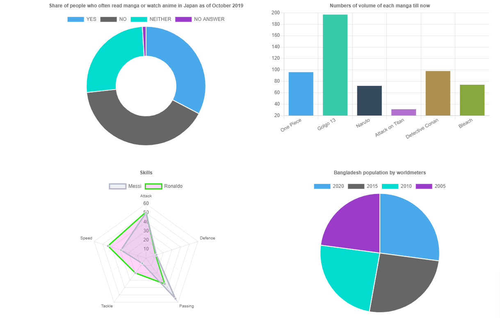
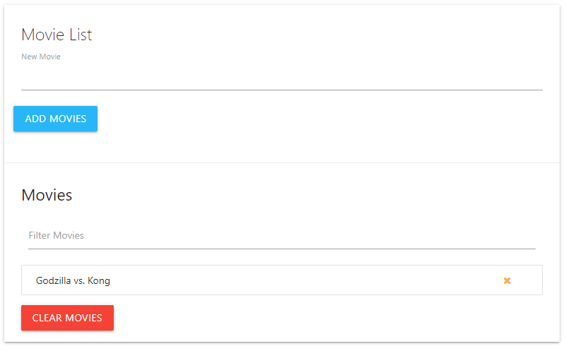

# JSLab
An expeirmental lab for simple HTML, CSS and JavaScript applications. 

## General info
* animation - Demo practice of various js simple animations as well as font awesome animation with js
* chart__js - Chart js version-2 demo project.

* contactFinder - Simple contact finder application using js.
* githubFinder - Find github profiles using this mini apps. Used Ajax to handle github api call.

* js_core - All the fundamentals of javascript coding
* loadCalculator - Simple loan calculator using javascript fundamentals. 

* movieList - Add your movie watch list with this simple js app.

* numberGuesser - A number guessing game using js.
 

## Technologies
* HTML5
* CSS3
* JS - ES5,ES6 & ES7
