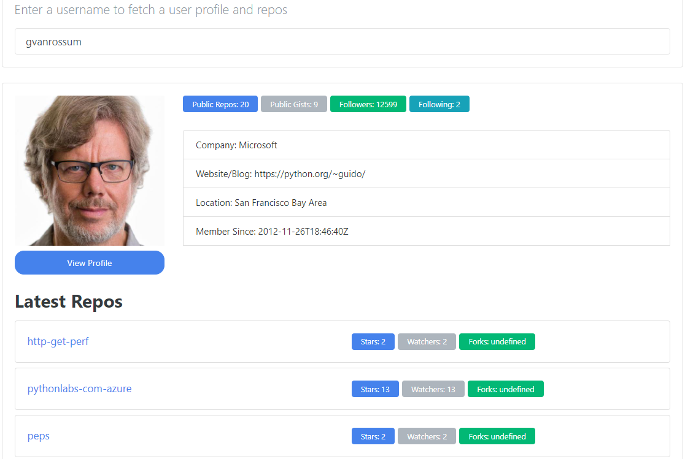
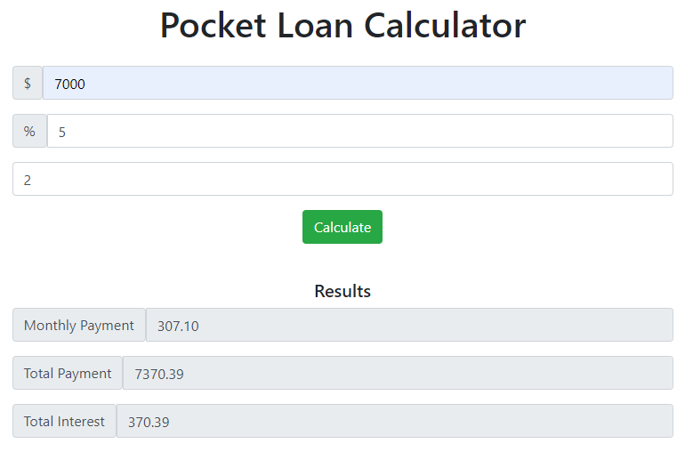

# JSLab
An expeirmental lab for simple HTML, CSS and JavaScript applications. 

## General info
* animation - Demo practice of various js simple animations as well as font awesome animation with js

* contactFinder - Simple contact finder application using js.

* githubFinder - Find github profiles using this mini apps. Used Ajax to handle github api call.

* loadCalculator - Simple loan calculator using javascript fundamentals. 

* movieList - Add your movie watch list with this simple js app.

* numberGuesser - A number guessing game using js. 

* phoneList - An interactive js app too see your saved phone numbes in your phonebook. 

* weightConverter - An interactive pound to kg, grams and ounces converter using js. 

## Technologies
* HTML5
* CSS3
* JS - ES5,ES6 & ES7

## Status
Project is: _in progress_

## Inspiration
Projects inspired by [Traversy](https://www.udemy.com/user/brad-traversy/), [Jonas](https://www.udemy.com/user/jonasschmedtmann/) udemy courses, various youtube videos and w3school

## Contributing
Pull requests are welcome. For major changes, please open an issue first to discuss what you would like to change.

## License
[MIT](https://choosealicense.com/licenses/mit/)
