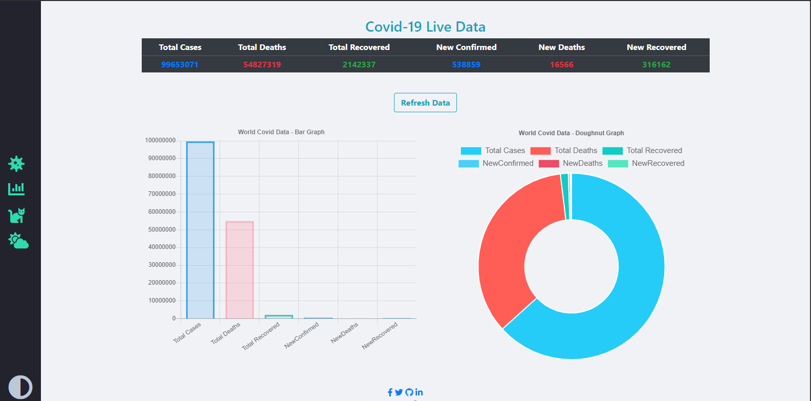

# covlert-19
Simple covid-19 data tracker with fetch api and chart js.

## Technologies
* Char.js - version 2.0
* API - https://covid19api.com/
* JS, Bootstrap4, CSS and HTML

## Screenshots

## Contributing
Pull requests are welcome. For major changes, please open an issue first to discuss what you would like to change.

## License
[MIT](https://choosealicense.com/licenses/mit/)

⚠️ Under Development 🚧
